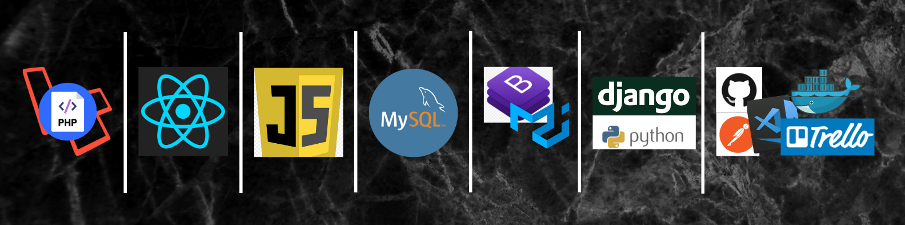

## Get in touch
 
 
 
 

## Languages and Tools

- 👋 Hi, I’m Leonard Ganyire
- 👀 I’m interested in software development and developing open-source wordpress plugins
- 📫 My email is ganyirel@gmail.com and my contact number is +263783575151

<!---
ganyire/ganyire is a ✨ special ✨ repository because its `README.md` (this file) appears on your GitHub profile.
You can click the Preview link to take a look at your changes.
--->
